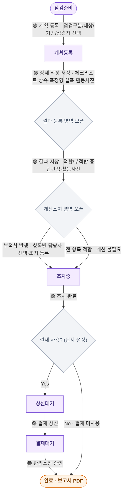
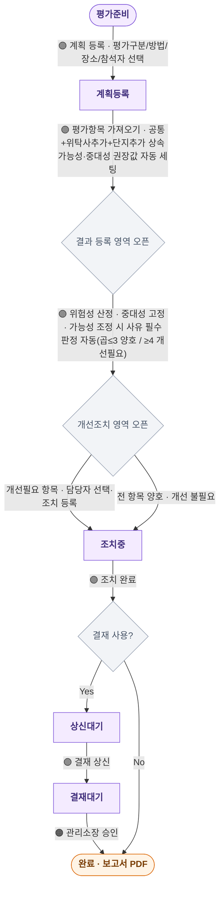
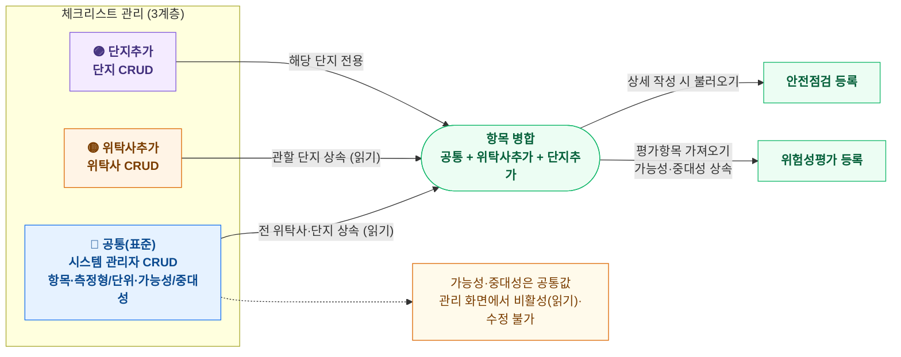
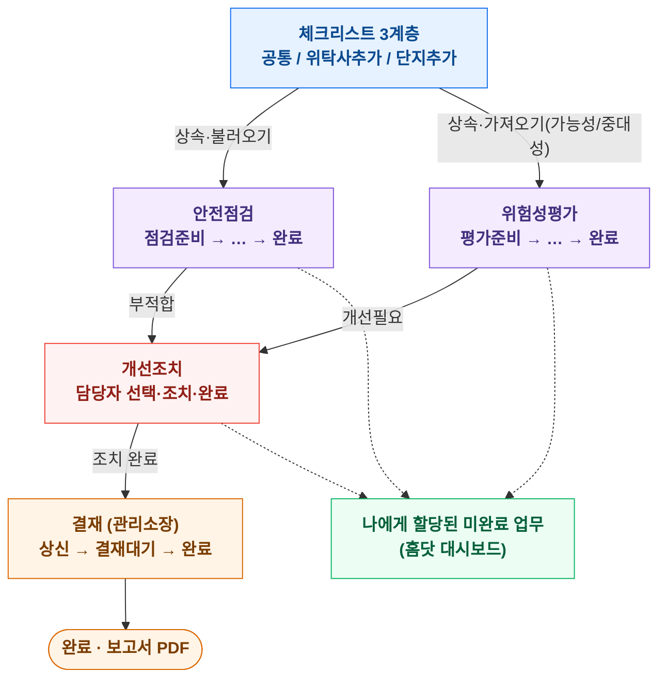

# [안전관리] 신규 메뉴 개발 — 통합 PRD

> 안전점검 활동 · 위험성평가 · 통합 개선조치
> 단지 = 수행 / 위탁사 = 총괄 · 웹 1차(모바일웹 최소) · 관리자앱 2차
> 작업 경로: 홈 > 업무관리(or 시설관리) > 안전관리(구. 안전교육) · 홈 > 통합업무계획
> PM 재훈 · 재구성본 v1.0 (기존 「홈닷_안전관리_통합_PRD」를 홈닷 표준 PRD 템플릿으로 카테고리 재구성)

---

## Change History

| Version | Date | Details | Editor |
|---|---|---|---|
| 0.1 | 2026-07-20 | 통합 PRD(안전점검·위험성평가·통합 개선조치) 초안 | 김재훈 |
| 1.0 | 2026-07-27 | 통합 프로토타입(단일 HTML) 반영, FR/RA 정리 | 김재훈 |
| 2.0 | 2026-07-29 | **홈닷 표준 PRD 템플릿으로 카테고리 재구성**(Change History·Overview·Task-Related Teams·Product Knowledge·Product Strategy·Policy·Deliverables·Action Item). 참고: [인사관리] 직원기본정보, [RFMS] 위탁사용 업무관리 메뉴 | 김재훈 |

---

## Overview

### 배경
- 단지/위탁사는 승강기·소방·전기·놀이시설 등 법정 안전 의무와 작업 위험을 종이·엑셀로 관리 중 → 누락·미이행·감사 대응 부담.
- 상당수 항목은 이미 정부 시스템(승강기망·cpf·FMS 등)에 법정 보고 중 → 홈닷은 '대체'가 아니라 **계획·수행·증빙·개선조치·위탁사 총괄** 레이어를 담당한다.
- 본 제품은 **(A) 시설물 중심 '안전점검'** 과 **(B) 근로자 작업 중심 '위험성평가'** 를 함께 다루며, 개선조치는 하나로 통합 관리한다.

### 규제 배경 — 산업안전보건법 · 중대재해처벌법
단지가 경비·미화·관리 직원을 두는 사업장이면 두 법의 근로자 안전 의무가 적용된다. (법 해석·도급관계 판단은 노무·법무 검토 필요)

- **적용 전제**: 중대재해처벌법은 상시근로자 5인 이상 전면 적용(2024.1.27~, 50인 미만 포함). 용역(도급) 시 단지(입대의)의 도급인 책임 범위가 쟁점.
- **중대재해처벌법 — 안전보건확보의무**: 안전보건관리체계 구축·이행(시행령 4조 9개 조치: 위험성평가 절차·비상대응·도급 평가기준 등) / 재발방지 / 시정명령 이행 / 관계법령 의무이행 점검.
- **산업안전보건법 — 주요 의무**: 안전보건관리책임자·관리감독자 / 위험성평가 실시·3년 보존 / 법정 안전보건교육 / 작업환경측정·건강진단 / 산재 기록·보고.
- **공동주택 특유 리스크**: 폭염·한파, 고령 근로자, 야간·단독 작업 → 점검·위험성평가·개선조치에서 실질적으로 다뤄야 함.
- **효과와 한계(중대재해처벌법 대응 관점)**:
  - 효과: 법은 '시스템 보유=자동 면책'을 규정하지 않으나, 안전보건확보의무의 실질 이행과 증빙이 처벌 여부·양형의 핵심 → 본 기능(수행·특이사항·개선 전후사진·이력·스냅샷)이 방어 자료로 유효.
  - 한계: 형식적 이행·미조치 방치 기록은 오히려 불리(미조치 가시화 필수). 적용은 근로자 재해 중심(입주민 사고는 별도 틀). 책임 주체·도급관계는 법률 이슈로 시스템이 대체 불가. **'면책 툴' 과장 금지.**

### 목적 및 범위
- **안전점검**: '계획 등록 → 상세 작성 → 결과 등록 → 개선조치 → 보고서' 루프를 홈닷에서 완결.
- **위험성평가**: 작업 유해·위험요인을 가능성×중대성(3×3, 하·중·상)으로 추정·결정하고 감소대책을 실행·기록.
- **개선조치 통합**: 안전점검 '부적합'과 위험성평가 감소대책을 하나의 개선조치(Improvement) 엔티티로 관리(Policy P4).

### 구현(해결) 방안
- 위탁사 사용자 계정 접속 후 **단지 미선택 = 위탁사(총괄) 메뉴**, **단지 선택 = 단지(수행) 메뉴**로 전환한다(RFMS 위탁사용 업무관리 메뉴 패턴 준용).
- 각 메뉴의 단지 데이터는 사용자가 관리하는(연결된) 단지 기준으로 노출한다.
- 안전점검·위험성평가는 프로세스 골격·상태·결재를 통일하고, 개선조치는 공통 엔티티로 통합한다.

### 대상 범위
- 관리자(PC) > 업무관리 or 시설관리 > 안전관리(구. 안전교육)
- 관리자(PC) > 홈 > 통합업무계획 (계획 배포·수립)
- 관리자(APP) — 2차 (현장 수행: 결과·사진, 카메라·오프라인)

---

## Task-Related Teams
- 제품 기획 : 김재훈
- 제품 디자인 : -
- 제품 개발(FE/BE) : -
- QA : -

---

## Product Knowledge

### 레퍼런스
- 안전365 (위험성평가 관리 항목·점검지 차용, 공동주택 보정)
- 일택 admin — 안전보건교육 이수현황/영상/사용현황 (위탁사 총괄 모니터링 참고)

### 용어 정의

| 용어 | 정의 |
|---|---|
| 안전점검 계획 | 통합업무계획에서 넘어온 당해년도 점검 계획(상태: 점검준비로 자동 등록) |
| 점검항목(체크리스트) | 계획별 확인 항목. 공통(표준) + 위탁사추가 + 단지추가 3계층 병합 |
| 측정형 항목 | 실측값(수치)+단위를 입력받는 체크 항목(착상 정확도·접지저항·산소농도·소음/진동 등). 메타데이터로 관리 |
| 종합 판정 | 점검 단위의 2단계 자동 판정(적합/부적합). 부적합 항목 1건+ 또는 추가발견 1건+이면 '부적합' |
| 위험성평가 | 작업 유해·위험요인을 가능성×중대성(3×3)으로 추정·결정하고 감소대책을 실행·기록 |
| 가능성(빈도) / 중대성(강도) | KOSHA 빈도·강도법 3×3. 하1/중2/상3. 위험성 = 가능성×중대성(1~9) |
| 위험성 등급 / 판정 | 낮음 ≤3 · 보통 4~6 · 높음 9 / 곱 ≤3 양호, ≥4 개선필요(읽기 전용 자동 산정) |
| 개선조치(Improvement) | 안전점검 '부적합'과 위험성평가 감소대책을 담는 공통 폐루프 엔티티 |
| 조치 결과 | 조치필요 / 조치완료 / 현재상태 유지(위험 수용). '조치완료'·'현재상태 유지'는 종료 처리 |
| 3계층 체크리스트 | 공통(표준, 시스템 관리자) · 위탁사추가(위탁사) · 단지추가(단지). 상속·병합해 소비 |
| 스냅샷 | 계획 저장 시점 체크리스트 고정. 표준 변경 시 diff opt-in 반영(기본 스냅샷 유지) |

---

## Product Strategy

### 유저 페르소나

| 유형 | 설명 | 주요 목표 |
|---|---|---|
| 단지 관리자(관리소장) | 단지 내 안전관리 감독·결재자 | 계획 작성(점검자 배정)·상세 작성 / 결과·조치 검토(담당자 배정) / 최종 결재 / 보고서(PDF) 출력 / 단지 설정 |
| 단지 직원(점검자/평가자) | 안전점검·위험성평가를 실제 수행 | 담당 일정·세부 파악 / 결과 등록(판정·실측값·특이사항·사진) / 위험성평가 수행 / 조치 완료 결재 상신 (모바일웹) |
| 단지 직원(담당자) | 부적합/개선필요 항목을 조치 | 할당된 조치필요사항 확인 / 조치 등록(내용·완료일·전후 사진) |
| 위탁사 안전관리 담당자 | 다수 단지 총괄 | 연간 계획 배포 / 표준 체크리스트·표준 유해위험요인 관리 / 관할 단지 이행 모니터링·독촉(이행 데이터 편집 불가) |

> 단지 내 권한 분리(관리자/직원)는 현재 프로토타입에서 '단지 뷰'로 합쳐 표현되며, 후속 반영 대상.

### 플랫폼 전략
- 웹(홈닷) 1차 — 기반 업무 + 현장 수행(결과·사진)은 모바일웹 최소 포함.
- 관리자 앱 2차 — 카메라·오프라인·푸시.

### 업무 시나리오 (역할별)
- **위탁사 안전관리 담당**: 표준 체크리스트·표준 유해위험요인 갱신 → 전 단지 상속. 대시보드로 이행률 모니터링, 미이행 독촉, 월말 보고서 취합.
- **단지 관리자(관리소장)**: 점검 계획 확인·상세 작성(점검자 배정), 직원 결과·개선 검토, 위험성평가 검토, 개선계획 확인 후 결재·보고서 출력.
- **단지 직원(현장)**: 점검 결과(적합/부적합/실측값/특이사항) 등록, 위험성평가 수행(가능성×중대성 3×3), '부적합'·감소대책 개선조치 실행·전후 사진 등록(모바일웹).

### 업무 프로세스 다이어그램
> 표기: 🟣 단지 담당자(점검자/평가자) · 🟠 단지 관리자(관리소장·결재자) · 🔵 시스템 관리자 · 🟡 위탁사
> 게이팅(회색 다이아몬드): 이전 단계 저장이 완료되어야 다음 입력 영역이 노출됨 — 프로세스 중간 진입 차단

#### 1) 안전점검 프로세스
상태: `점검준비 → 계획등록 → 조치중 → 상신대기 → 결재대기 → 완료`

#### 2) 위험성평가 프로세스
상태: `평가준비 → 계획등록 → 조치중 → 상신대기 → 결재대기 → 완료`
KOSHA 빈도·강도법 3×3: `위험성 = 가능성 × 중대성` (1~9)

#### 3) 체크리스트 관리 (3계층 · 상속 · 소비)

#### 4) 전체 연계도

### 성공지표 (참고)
점검 정시 이행률 / 부적합 점검 비율 / 조치 완결률(조치완료·현재상태 유지 ÷ 부적합) / 결재 대기 건수 / 위험성평가 실시율 / 증빙 첨부율 / 보고서 승인율.

---

## Policy

### 작업 경로
- 홈 > 업무관리(or 시설관리) > 안전관리
- 홈 > 통합업무계획 (계획 배포·수립)

### 업무기반 케이스 분류 (위탁사 ↔ 단지)

| 케이스 | 업무 구분 | 안전관리 적용 |
|---|---|---|
| 단지 업무 전체 (수행) | 단지가 점검·평가·개선조치를 직접 수행 | 안전점검 활동, 위험성평가, 개선조치, 체크리스트(단지추가) |
| 위탁사 내부 + 단지 업무 조회 | 위탁사가 표준 관리 + 단지 이행 조회·독촉 | 표준 체크리스트/유해위험요인 관리, 총괄 대시보드, 안전보건교육 현황 |

### 역할분리 매트릭스
위탁사는 이행 데이터에 대해 **조회+독촉만**, 표준(체크리스트·유해위험요인)은 **관리**한다.

| 기능 | 단지 | 위탁사 |
|---|---|---|
| 안전점검 상세·결과·개선 | C·R·U | R |
| 위험성평가 상세·결과·개선 | C·R·U | R |
| 보고서 결재(관리소장) | C·R·U (단지 설정 on/off) | R |
| 표준 체크리스트·유해위험요인 | R (상속) | C·R·U (위탁사추가) |
| 단지추가 체크리스트·유해위험요인 | C·R·U (해당 단지) | – |
| 이행 현황(대시보드) | – | R + 독촉 |

---

### P1. 안전점검 활동

**메뉴 × ACTION 요약**

| ACTION | 항목 | 로직 및 세부사항 |
|---|---|---|
| 조회(목록) | 점검명·점검대상·점검구분·기간·점검자·단계(4)·종합판정·상태 | 필터: 점검대상·점검구분·상태(결합). 단계 진행(상세/결과/개선/보고) 표시, 다건선택→보고서 출력 |
| 등록(계획) | 통합업무계획 연동 | 통합업무계획에서 수립 → 목록 자동 등록(상태: 점검준비) |
| 상세(정보) | 점검명·종류·기간·장소·점검자·점검가이드 | 점검자는 임직원 마스터에서 선택(자격 검증), 저장 시 게이팅 오픈 |
| 상세(결과) | 판정·실측값·특이사항·사진 | 적합/부적합/해당없음 + 측정형 실측값 + 항목 사진 + 활동 사진 |
| 상세(개선) | 담당자 할당·조치 결과 | 부적합/추가발견 자동 이관, 담당자 할당→조치 등록 |
| 결재 | 상신·결재 | 상신대기 → 결재대기 → 완료(2단계), PDF 상시 다운로드 |

**상세 요구사항 (FR)**

- **FR-101** 계획은 통합업무계획에서 수립되어 안전점검 활동 목록에 자동 등록된다(상태: 점검준비).
- **FR-102** 목록은 점검대상·점검구분·상태 필터(결합 적용), 단계 진행(상세/결과/개선/보고) 표시, 상세 진입을 제공한다. 점검구분(주간/합동/순회/수시/기타점검)은 그리드 컬럼으로도 출력한다.
- **FR-103** 점검종류별 법정 주기(자체점검·정기검사)를 마스터로 보유해 회차·알림 기준으로 사용한다(부록 A-3).
- **FR-104** 계획등록 화면에서 '이전 점검내용 가져오기'로 기존 계획을 선택해 점검구분·점검대상·점검장소·점검자를 자동 입력한다. 점검항목은 이전 스냅샷이 아니라 선택한 점검대상의 '최신 표준'(위탁사 공통 + 우리 단지추가)으로 불러온다.
- **FR-111** 점검명·점검종류·점검기간·점검장소·점검자(직원 선택)·점검가이드(파일)를 입력한다. 점검기간은 시작·종료 모두 YYYY-MM-DD 전체 표기로 통일한다(목록·상세·보고서 공통).
- **FR-112** 점검항목은 위탁사 표준을 불러오고 작성자가 항목을 추가한다(저장 시 스냅샷 고정).
- **FR-113** 작성자가 추가한 항목은 '단지 체크리스트에도 등록' 여부를 확인받아 단지추가로 영구 등록(중복 방지, 위탁사 표준엔 추가 안 함).
- **FR-113a** 점검자·위험성평가 참석자·조치 담당자는 자유입력이 아니라 홈닷 임직원 마스터(선임·자격 정보 포함)에서 선택한다. [자격 검증] 점검 유형별 법정 자격·선임 요건(부록 A-4)과 대조해 미충족자 배정 시 경고하고, 자격·선임의 유효기간(만료) 도래·초과를 표시한다.
- **FR-121** 항목별 적합/부적합/해당없음으로 판정하고 특이사항을 입력한다. 저장 시 '부적합'은 개선조치 대상으로 자동 이관.
- **FR-122** 판정 기준을 문항 표현과 무관하게 고정하기 위해 체크 항목은 '정상 상태' 서술형으로 통일한다(예: '운행 중 이상음·진동 없음'). 적합=정상 상태 충족, 부적합=미충족. '~여부'식 이중해석 문항은 금지.
- **FR-123** 체크 항목은 '측정형' 여부를 메타데이터로 갖는다. 측정형 항목만 결과 등록 화면에 실측값(수치)+단위 입력칸을 노출하고, 비측정 항목은 실측값 칸을 노출하지 않는다('–'). 실측값은 특이사항과 분리된 구조화 필드.
- **FR-124** 점검 단위의 종합 판정(2단계: 적합/부적합)을 항목 결과에서 자동 산출한다. 부적합 항목 1건+이면 '부적합', 없으면 '적합'. 종합 판정은 점검 시점 findings이므로 이후 모두 조치완료돼도 '적합'으로 자동 변경하지 않고 유지한다(이력·증빙 보존).
- **FR-125** 점검자는 결과 등록 화면에서 체크리스트에 없는 현장 발견사항을 '추가 조치 필요사항'으로 등록할 수 있다. 추가 항목은 '추가발견' 표시와 함께 개선조치로 이관되며(조치필요 초기 상태), 종합 판정은 '부적합'이 된다. 저장·재저장 시 보존.
- **FR-126** 결과 등록 화면에서 항목별로 점검 사진을 첨부한다(항목당 1장+, 썸네일). '부적합' 항목 사진은 개선조치 등록 시 '개선 전' 사진으로 자동 연동되어 전/후 비교가 성립한다.
- **FR-127** 결과 등록 화면에 '점검 활동 사진'을 항목별 사진과 별개로 여러 장 등록·삭제한다(현장 기록·증빙). 위험성평가도 '평가 활동 사진'을 동일하게 결과 등록 단계에 등록한다.
- **FR-130** 상태 '조치중'인 안전점검의 조치 사항을 확인하고 각 조치 대상에 담당자를 할당한다(점검자·단지 안전관리 담당자 대상). 담당자 할당은 조치 결과 등록과 분리된 선행 단계이며, 미할당 항목은 시각적으로 강조.
- **FR-131** 할당받은 담당자가 조치 대상별로 조치 내용(대책·개선사항 통합)·조치 완료일·조치 결과·전/후 사진을 등록한다. 미조치 건은 강조·독촉.
- **FR-132** 조치 결과는 '조치필요 / 조치완료 / 현재상태 유지'로 선택한다(초기 조치필요). '조치완료'·'현재상태 유지'는 종료 처리(단계 완료·보고서 집계 반영), '조치필요'는 진행중. '조치완료' 시 조치 완료일 필수, '현재상태 유지'(위험 수용) 선택 시 조치 내용에 사유 필수.
- **FR-133** 개선조치는 위험성평가 감소대책과 공통 개선조치(Improvement) 엔티티로 통합 저장·관리(P4).
- **FR-141** 점검 정보·결과·조치 전후 내역을 보고서로 집계한다(내부 증빙·보고용, 정부 제출 대체 아님).
- **FR-142** 결재는 상신 기반 2단계로 운영한다. 결과·조치가 끝났으나 상신 전이면 '상신대기'(담당자 상신 필요), 담당자가 '결재 상신'하면 '결재대기'(상위권자 결재 필요), 관리소장이 보고서에서 결재하면 '완료'.
- **FR-143** 결재 시 조치 미완('조치필요') 항목이 있으면 개선계획 확인 강제(rubber-stamp 방지), 상신자·상신일시·결재자·결재일시를 기록.
- **FR-144** 보고서는 상신·결재 상태와 무관하게 언제든 PDF 다운로드(보고서 화면 상·하단 양쪽 버튼).
- **FR-145** 목록에서 다건 선택 → 보고서 일괄 미리보기·인쇄(PDF).

---

### P2. 위험성평가

**실시 주기 & 평가방법**
- 주기: 최초(성립일 1개월 이내) / 정기(1년) / 수시(이벤트) / 상시 / 월간.
- 방법: 가능성(하1/중2/상3) × 중대성(하1/중2/상3) = 위험성(1~9). 등급: 낮음 ≤3 · 보통 4~6 · 높음 9. 판정: 곱 ≤3 양호 / ≥4 개선필요.

**상세 요구사항 (RA)**

- **RA-101** 평가구분(최초/정기/수시/상시/월간)·평가방법(자체/위탁)·평가명·평가일(기간)·장소·참석자로 등록한다.
- **RA-102** 목록은 평가구분·검색어 필터, 항목수·최고 위험성·상태를 표시한다.
- **RA-111** 평가내용은 (평가항목 분류 + 유해/위험요인) 행의 목록. '평가항목 가져오기'로 표준 라이브러리에서 다건 선택·불러오기, 직접 추가·삭제 가능. 가져오기 모달은 카테고리별 '전체 선택'(부분 선택 시 indeterminate)을 제공.
- **RA-112** 유해/위험요인은 작업맥락 프리픽스(시설관리·경비·미화·배달 등)를 포함한다.
- **RA-113** 척도는 KOSHA '빈도·강도법' 3×3(곱 1~9). 빈도(가능성): 상3 자주/중2 가끔/하1 거의 없음. 강도(중대성): 상3 사망·장애/중2 휴업/하1 경미. '평가항목 가져오기' 시 표준의 권장 가능성·중대성을 상속.
- **RA-114** 항목별 가능성×중대성 선택 시 위험성 점수·등급과 판정을 자동 산정하고 3×3 매트릭스로 시각화한다. 판정은 곱으로 자동 산정되는 읽기 전용 값이며 직접 편집하지 않는다. 판정을 바꾸려면 가능성을 조정한다(사유에 대책 기록).
- **RA-115** [B안·축별 차등] 중대성은 재해 심각도에 근거해 '표준 고정(수정 불가, 🔒)'. 가능성은 현장 편차가 크므로 기본값을 제공하되 단지가 조정 가능(조정 시 사유 필수).
- **RA-116** 표준 권장값 근거 구분 — [중대성] 재해 결과 심각도 매핑(승강기 끼임·감전·밀폐공간 질식=상). [가능성] 보편 근거가 없어 '기본 세팅값'만 제공, 현장 조정 전제. 공통(표준) 평가항목·유해/위험요인은 시스템 관리자가 관리(전 단지 공통), 위탁사는 '위탁사추가', 단지는 '단지추가'를 관리한다.
- **RA-117** 상세 작성 화면에서 '이전 위험성평가 가져오기'로 기존 평가를 선택해 평가구분·평가방법·장소·참석자·평가항목을 자동 입력한다(반복 평가 재입력 최소화). 가능성·중대성은 이전 값이 아니라 최신 표준 권장값으로.
- **RA-118** 상세 화면은 안전점검·위험성평가 공통으로 순차 게이팅한다. '상세 저장' → ② 결과 등록 오픈, '결과 저장' → ③ 개선조치·④ 결재 오픈. 상세 저장은 항목 1건+를 요구한다.
- **RA-119** 체크리스트 관리 화면(단지·위탁사)에서 유해/위험요인별 가능성·중대성을 비활성 드롭다운+🔒로 확인한다(시스템 관리자만 설정). '평가항목 가져오기' 시 공통값이 등록에 상속.
- **RA-121** 판정 '개선필요'(곱 ≥4) 항목에 감소대책을 등록(높음 등급은 강제·강조). 잔존 위험성 재추정은 후속(Phase 2).
- **RA-131** 감소대책은 안전점검 개선조치와 통합 개선조치로 관리(P4). 조치 시 조치 내용·완료일·조치 결과(조치필요/조치완료/현재상태 유지)·전후 사진 기록.
- **RA-132** 위험성평가 ③ 개선조치도 안전점검과 동일하게 항목별 담당자 할당(할당/변경)을 제공한다. UI 명칭은 두 업무의 ③ 단계 모두 '개선조치'로 통일.
- **RA-141** 프로세스 골격·상태·결재는 안전점검과 통일한다(평가준비 → 계획등록 → 조치중 → 상신대기 → 결재대기 → 완료).
- **RA-142** 위험성평가 고유 요소(공유 안 함): 판정 축(위험등급·양호/개선필요), 결과 입력(참석자·가능성/중대성·감소대책), 트리거(최초/정기/수시/상시), 잔존 위험성 재평가(Phase 2).

---

### P3. 체크리스트 관리 (3계층 · 스냅샷)

- **FR-161** 체크리스트는 3계층으로 관리한다. [공통(표준)] 시스템 관리자만 CRUD — 항목·측정형/단위·위험성평가 권장 가능성/중대성 포함(위탁사·단지 읽기 전용). [위탁사추가] 위탁사 CRUD, 관할 단지 상속. [단지추가] 단지 CRUD, 해당 단지 한정.
- **FR-162** 항목별 '측정형' 여부·단위(안전점검)와 위험성평가 가능성·중대성은 공통(표준) 메타데이터로 시스템 관리자만 설정한다. 관리 화면(단지·위탁사)에서는 읽기 전용(위험성평가 가능성·중대성은 비활성 드롭다운+🔒).
- **FR-165** 계획 저장 시점 체크리스트를 스냅샷으로 고정, 수정 시 diff opt-in 반영(기본 스냅샷 유지).

---

### P4. 통합 개선조치 데이터 모델 (안전점검 · 위험성평가 공통)

안전점검 '부적합' 개선과 위험성평가 감소대책은 동일한 개선조치(Improvement) 엔티티로 저장한다(하나의 폐루프). 별도의 '통합 개선조치' 조회 화면은 두지 않고, 각 개선조치는 출처 업무 상세의 ③ 개선조치에서 조회·처리한다.

| 필드 | 타입 | 설명 |
|---|---|---|
| id | PK | 개선조치 고유 ID |
| source | enum | '안전점검' \| '위험성평가' |
| sourceRefId | FK | 출처(점검/평가) 및 항목 참조 |
| title | text | 조치 항목명(부적합 항목 / 유해·위험요인) |
| riskGrade | enum | 위험성평가 등급(낮음/보통/높음), 안전점검은 null |
| assignee | FK | 담당자(임직원 마스터) |
| content | text | 조치 내용(대책·개선사항 통합) |
| status | enum | 조치필요 / 조치완료 / 현재상태 유지 |
| dueDate / doneDate | date | 조치 완료일 |
| beforePhoto / afterPhoto | file | 조치 전/후 사진 |

- **INT-1** 두 기능은 개선조치 생성 시 위 공통 엔티티에 기록한다.
- **INT-2** riskGrade 높음(및 보통) 및 기한초과 건을 우선순위 상단으로 정렬·강조(중대재해 방어).
- **INT-3** 별도 통합 개선조치 화면은 제거한다. 개선조치 현황은 각 출처 업무 상세의 ③ 개선조치에서 확인하며, 담당자 관점은 안전 일정 '내 조치'로 대체한다.

---

### P5. 단계 진행(순차 게이팅) & 공통 UI

- **FR-151** 상세·결과·조치·보고서는 서로 다른 작성자·시점에 수행할 수 있으나, 화면은 순차 게이팅으로 진행한다(상세 저장→결과 열림, 결과 저장→조치·결재 열림). 각 단계는 독립 저장·상태 표기(RA-118).
- **FR-152** 상세·보고서 화면 상단 뒤로가기는 '이전'으로 표기하고, 항상 목록이 아니라 진입 직전 화면으로 복귀한다(안전점검·위험성평가·체크리스트 공통).

---

### P6. 위탁사 총괄 — 대시보드 집계

대시보드 수치는 관할 단지들의 안전점검 데이터를 집계한 **읽기 전용 파생값**이다. 원천은 단지가 입력한 종합 판정·조치 결과·결재 상태이며, 위탁사는 편집하지 않는다. 집계 단위는 조회 기간 내 해당 단지의 안전점검 계획(plan)이다.

| 지표 | 집계 정의 | 원천 필드 |
|---|---|---|
| 부적합 점검(bad) | 종합 판정 '부적합' 점검 수(부적합 항목 1건+ 또는 추가발견 1건+) | results[].res='부적합' OR improves[].adhoc=true → verdict='부적합' |
| 조치 종료(closed) | 부적합 점검 중 모든 조치 대상이 종료된 점검 수 | improves[].status ∈ {조치완료, 현재상태 유지} 전건 |
| 조치 완결률 | closed ÷ bad | 파생 |

- 독촉 대상 분기: 미이행·지연 → 단지 담당자, 결재 대기 → 관리소장(결재자).
- '현재상태 유지(위험 수용)'도 조치 종료로 집계하나, 남용 감시를 위해 사유·건수는 상세 조회에서 별도 확인한다.

---

## Deliverables
- 통합 프로토타입(단일 HTML) — 안전점검·위험성평가·통합 개선조치·체크리스트·위탁사 총괄 플로우.
- 피그마 시안(HomeDot 테마) — 체크리스트 관리·안전점검·위험성평가 목록/상세/모달.
- (참고) 안전보건교육 이수 현황·영상/사용관리·일별/월별 현황 — 위탁사 총괄 모니터링 프로토타입.

---

## Out of Scope
- 정부 시스템 직접 API 연동·자동 보고 — 별도 검토.
- 관리자 앱 네이티브(카메라·오프라인·푸시) — 2차 / 잔존 위험성 자동 재평가 — 후속.
- 안전관리 예산 / 위원회 / 성과·KPI — Phase 3.
- 외부 점검·평가 업체 발주·정산.
- 법정의무교육 콘텐츠(기존 안전교육) — 단, **안전보건교육 이수 현황·영상/사용관리·일별/월별 사용현황(위탁사 총괄 모니터링)** 은 일택 admin 레퍼런스 기반으로 별도 검토·프로토타입 진행 중.
- 정량적 위험성평가(JSA·HAZOP) / 법정 서식 1:1 출력 정합화 — 안전관리자 검수 후.

---

## Edge Cases

| 케이스 | 처리 방향 |
|---|---|
| '부적합'·고위험 개선 미완 방치 | 미조치 강조·독촉 — 중대재해 방어 최우선 |
| 계획 저장 후 표준 변경 | 스냅샷 기준 유지, 수정 시 diff opt-in |
| 결재 미사용 단지 | 조치중 → 완료 직행(상신/결재 스킵) |
| 종합 판정 후 전건 조치완료 | '적합'으로 자동 변경하지 않고 '부적합' 유지(이력·증빙) |
| 위탁사추가·단지추가 유해요인 | 공통 권장값 없음 → '평가 시 입력' 표시 |

### 외부 감사 대응 — 보완 요건 (갭 점검)
근거: 「사업장 위험성평가에 관한 지침」 — 전 과정 근로자 참여 보장 · 3년 기록 보존 · 연 1회 적정성 재검토.

| 보완 요건 | 내용 · 근거 | 반영 |
|---|---|---|
| 근로자 참여 증빙 | 위험성평가 전 과정 근로자 참여 보장. 참석자 역할(관리/현장근로자) 구분·참여 확인(서명), 미참여 시 경고 | Phase 1 강화 |
| 잔존 위험성 재평가 | 감소대책 실행 후 위험성 재추정·연 1회 적정성 재검토, 이력 보존 | Phase 2 |
| 점검자 자격 표시 | 점검 유형별 법정 자격·선임 요건 대조·경고(부록 A-4) | Phase 1 |

우선순위: (1) 근로자 참여 증빙, (2) 잔존 위험성 재평가, (3) 점검자 자격 표시.

---

## Action Item (다음 단계)
- [ ] 부록 A-2 법령 검증·A-3 주기·부록 B 등급구간을 법무·시설·안전관리자 검수(공식 서식 매핑).
- [ ] 첨부 통합 프로토타입(단일 HTML)으로 안전점검·위험성평가·통합 개선조치 플로우 확인.
- [ ] 확정 시 → 통합 개선조치 데이터 모델(P4) 기준 화면설계·API 정의로 이관.
- [ ] 위탁사/단지 뷰 전환(단지 미선택=위탁사) IA 확정 — RFMS 위탁사용 업무관리 메뉴와 정합.

---

## Appendix A. 안전점검 — 체크리스트 · 법령 · 주기

### A-1. 점검항목별 체크리스트

| 점검항목 | 체크 항목 |
|---|---|
| 승강기 자체점검 | 운행 중 이상음·진동 / 도어 개폐 / 비상통화장치 / 착상 정확도 / 조명·환기 |
| 소방 작동점검 | 비상구·피난통로 / 유도등·비상조명 / 소화기 비치·압력 / 소화전·호스·노즐 / 감지기·스프링클러 / 비상벨·방송 / 비상연락망 |
| 어린이놀이시설 안전점검 | 볼트·연결부 조임 / 표면 파손·모서리 / 바닥 충격흡수재 / 그네·미끄럼틀 마모 / 이물질·위험물 |
| 저수조 청소·수질검사 | 내부 오염·침전물 / 맨홀 잠금·방충망 / 시료 채취 / 소독 실시 |
| 전기설비 정기점검 | 수배전반 발열·소음 / 누전차단기 동작 / 접지저항 / 배선 피복 |
| 건축물 정기안전점검 | 외벽 균열·박리 / 옥상 방수·누수 / 계단·난간 / 지하 구조부 |

> 판정 단위: 적합 / 부적합 / 해당없음 + 실측값(측정 항목) + 특이사항. '부적합'은 개선조치 이관. 항목은 '정상 상태' 서술형으로 통일.

### A-2. 법령 적합성 검증 (2026-07 웹 확인)
주기·수행자격을 개별 법령으로 확인함(A-3·A-4). 공식 별지 서식·고시 세부 기준(대상 규모·용도별 주기 차등)은 배포 전 시설·안전관리자 최종 검수 필요.

### A-3. 법정 점검 주기 (근거 확인)

| 설비 | 자체점검 | 정기검사(외부) | 근거 |
|---|---|---|---|
| 승강기 | 월 1회 이상 | 정기검사 2년 이하(종류·연수별) | 승강기 안전관리법 §31 |
| 소방 | 작동점검·종합점검(대상별 주기 상이) | — | 화재예방·소방시설법·시행규칙 별표3 |
| 어린이놀이시설 | — | 2년마다 정기시설검사 | 어린이놀이시설 안전관리법 |
| 전기설비 | — | 정기검사(용량·용도별 1~3년) | 전기안전관리법 |

### A-4. 점검자 자격 · 수행주체 (법령 근거)
외부 감사 대응(Edge '점검자 자격')의 근거. 법정점검은 아래 자격·주체가 수행해야 하며, 시스템은 점검자 배정 시 자격을 표시·검증한다.

| 설비 | 수행 자격·주체 | 근거 |
|---|---|---|
| 승강기 자체점검 | 승강기 기사, 또는 승강기 산업기사+실무 2개월 이상(직무교육 이수). 유지관리업 위탁 가능 | 승강기 안전관리법 |
| 소방 자체점검 | 소방시설관리업자, 선임된 소방안전관리자, 또는 소방기술사 | 화재예방·소방시설법 |

> 주의: 자격·주기 세부(대상 규모·용도·층수별 차등, 최신 개정)는 법령 원문·소관 고시로 최종 확인 필요.

---

## Appendix B. 위험성평가 — 평가항목 · 표준 유해/위험요인

'평가항목 가져오기' 라이브러리. 안전365 위험성평가 관리 항목 차용·공동주택 보정. 분류·요인·등급 구간은 안전관리자 검수 후 확정.

| 평가항목(분류) | 표준 유해/위험요인 (예시) |
|---|---|
| 1. 기계(설비)적 요인 | (시설관리)승강기 등 유지보수 시 끼임 / (시설관리)정리정돈 부재 충돌·넘어짐 / (경비)차단기·주차설비 끼임 / (미화)청소장비 오작동 |
| 2. 전기적 요인 | (시설관리)전기기계기구 감전 / (시설관리)노후 배선·누전 감전·화재 |
| 3. 화학(물질)적 요인 | (미화)세제·소독제 흡입·피부접촉 / (시설관리)페인트·유증기 노출 |
| 4. 작업특성 요인 | (경비)장시간 서서하는 작업 / (미화)근골격계 부담 / (미화)중량물 요통 / (경비)야간작업 피로·침입 |
| 5. 작업환경 요인 | (시설관리)밀폐공간 산소결핍·질식 / (조경)예초작업 소음·비산물 / (제설)강설 미끄러짐·한랭 |

### B-1. 위험성 등급 (3×3)

| 등급(3×3) | 판정 | 조치 방향 |
|---|---|---|
| 낮음(1~3) | 양호 | 현 상태 유지·주기 점검 |
| 보통(4~6) | 개선필요 | 개선 권고·감소대책 |
| 높음(9) | 개선필요 | 즉시 개선·강제 |

> 가능성·중대성은 하(1)/중(2)/상(3). 곱 ≤3 양호, ≥4 개선필요. 표준 권장값을 단지가 조정 시 사유 필수(B안).
